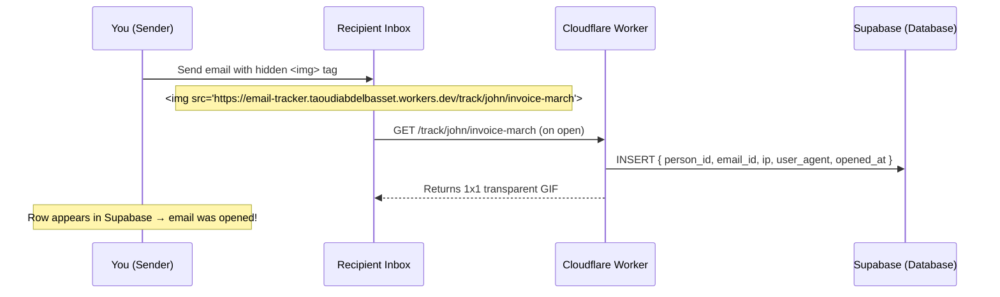

# 📧 Hidden Mail Tracker — Cloudflare Workers

A lightweight, serverless email open tracker. Embed an invisible 1×1 pixel image in any email — when the recipient opens it, their email client fetches the image and your server silently logs the event to a private database.

No paid services. No credit card. Fully serverless.

---

## How it works



---

## Stack

| Layer | Tool | Cost |
|---|---|---|
| Server | Cloudflare Workers | Free (100k req/day) |
| Database | Supabase | Free tier |
| Runtime | Hono (lightweight web framework) | Free |
| Repo | GitHub | Free |

---

## Project structure

```
email-tracker/
├── index.js          # Main worker code (tracking logic)
├── wrangler.toml     # Cloudflare Workers config
├── package.json      # Dependencies
└── .env              # Local only — never committed
```

---

## Code explained

### `index.js`

```javascript
import { Hono } from 'hono';

const app = new Hono();

// The 1x1 transparent GIF encoded in base64
const PIXEL = 'R0lGODlhAQABAIAAAAAAAP///yH5BAEAAAAALAAAAAABAAEAAAIBRAA7';

// Core tracking route — fires every time the email is opened
app.get('/track/:personId/:emailId', async (c) => {
  const personId = c.req.param('personId'); // who received the email e.g. "john"
  const emailId = c.req.param('emailId');   // which email e.g. "invoice-march"

  // Log to Supabase in the background
  // waitUntil = don't wait for this to finish before sending the pixel back
  // This makes the response instant for the recipient
  c.executionCtx.waitUntil(
    fetch(`${c.env.SUPABASE_URL}/rest/v1/opens`, {
      method: 'POST',
      headers: {
        'Content-Type': 'application/json',
        'apikey': c.env.SUPABASE_KEY,           // stored in Cloudflare secrets
        'Authorization': `Bearer ${c.env.SUPABASE_KEY}`,
        'Prefer': 'return=minimal'
      },
      body: JSON.stringify({
        person_id: personId,
        email_id: emailId,
        ip: c.req.header('cf-connecting-ip'),   // real IP via Cloudflare header
        user_agent: c.req.header('user-agent')  // device/browser info
      })
    })
  );

  // Decode and return the invisible pixel immediately
  const binary = Uint8Array.from(atob(PIXEL), c => c.charCodeAt(0));
  return new Response(binary, {
    headers: {
      'Content-Type': 'image/gif',
      'Cache-Control': 'no-store, no-cache, must-revalidate' // prevent caching — critical!
    }
  });
});

app.get('/', (c) => c.text('Tracker running'));

export default app;
```

### `wrangler.toml`

```toml
name = "email-tracker"         # Worker name on Cloudflare
main = "index.js"              # Entry point
compatibility_date = "2024-01-01"
```

---

## Database schema (Supabase)

Run this SQL in your Supabase SQL Editor:

```sql
create table opens (
  id bigint generated always as identity primary key,
  person_id text not null,
  email_id text not null,
  opened_at timestamptz default now(),
  ip text,
  user_agent text
);

-- Enable Row Level Security
alter table opens enable row level security;

-- Allow server to write logs
create policy "allow insert" on opens
  for insert with check (true);

-- Block all reads from outside
create policy "block reads" on opens
  for select using (false);
```

---

## Setup & deployment

### 1. Prerequisites

- Node.js 20+
- A [Cloudflare](https://cloudflare.com) account (free)
- A [Supabase](https://supabase.com) account (free)

### 2. Clone the repo

```bash
git clone https://github.com/YOURNAME/email-tracker.git
cd email-tracker
git checkout cloudflare-workers
npm install
```

### 3. Set up Supabase

1. Go to [supabase.com](https://supabase.com) → New project
2. Run the SQL above in the SQL Editor
3. Go to **Settings → API** and copy:
   - `Project URL`
   - `anon public key`

### 4. Login to Cloudflare

```bash
npx wrangler login
```

### 5. Add your secrets

```bash
wrangler secret put SUPABASE_URL
# paste your https://xxxx.supabase.co

wrangler secret put SUPABASE_KEY
# paste your eyJ... anon key
```

### 6. Deploy

```bash
npm run deploy
```

Your worker is live at:
```
https://email-tracker.YOUR_SUBDOMAIN.workers.dev
```

---

## Usage

### Embed in an email

```html

```

**Example — tracking John's March invoice:**
```html

```

When John opens the email → a row appears in your Supabase `opens` table:

| person_id | email_id | opened_at | ip |
|---|---|---|---|
| john | invoice-march | 2024-03-26 14:32 UTC | 142.250.x.x |

### Multiple opens

Every open logs a new row — so you can see open count and timestamps:

| person_id | email_id | opened_at |
|---|---|---|
| john | invoice-march | 14:32 |
| john | invoice-march | 14:45 |
| sarah | follow-up | 15:01 |

---

## Limitations

| Issue | Detail |
|---|---|
| Gmail/Apple Mail proxy images | IP will be Google's server, not the real user. Open event still fires. |
| Pre-fetching | Some clients fetch images before user opens. Rare. |
| Forwards | Forwarded emails log under original recipient's ID |
| Image blocking | Users with images disabled won't trigger the tracker |

---

## Security

- ✅ Secrets stored in Cloudflare dashboard — never in code or repo
- ✅ All traffic over HTTPS
- ✅ Supabase RLS enabled — data not readable via API
- ✅ Server → server requests only — recipient never sees your keys