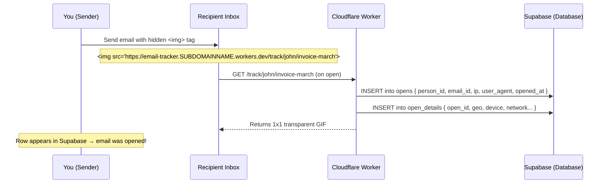

# 📧 Hidden Mail Tracker — Cloudflare Workers

A lightweight, serverless email open tracker. Embed an invisible 1×1 pixel image in any email — when the recipient opens it, their email client fetches the image and your server silently logs the event to a private database.

No paid services. No credit card. Fully serverless.

---

## How it works



---

## Stack

| Layer | Tool | Cost |
|---|---|---|
| Server | Cloudflare Workers | Free (100k req/day) |
| Database | Supabase | Free tier |
| Runtime | Hono (lightweight web framework) | Free |
| Repo | GitHub | Free |

---

## Project structure

```
email-tracker/
├── index.js          # Main worker code (tracking logic)
├── wrangler.toml     # Cloudflare Workers config
├── package.json      # Dependencies
└── .env              # Local only — never committed
```

---

## Database schema (Supabase)

Two tables: `opens` holds the core event, `open_details` holds all enriched metadata and references `opens` via foreign key. This separation lets you add or remove detail fields without touching the core opens table.

Run this SQL in your Supabase SQL Editor:

```sql
-- Core open event
create table opens (
  id bigint generated always as identity primary key,
  person_id text not null,
  email_id text not null,
  opened_at timestamptz default now(),
  ip text,
  user_agent text
);

-- Enriched metadata (references opens)
create table open_details (
  id uuid primary key default gen_random_uuid(),
  open_id int8 not null references opens(id) on delete cascade,

  -- network
  ip_forwarded    text,
  country_code    text,

  -- cloudflare geo (free, no external API needed)
  cf_country      text,
  cf_city         text,
  cf_region       text,
  cf_latitude     text,
  cf_longitude    text,
  cf_timezone     text,
  cf_asn          integer,
  cf_org          text,
  cf_postal       text,
  cf_metro        text,
  cf_is_eu        boolean,

  -- device
  accept_language text,
  referer         text
);

-- Enable Row Level Security
alter table opens enable row level security;
alter table open_details enable row level security;

-- Allow server to write logs
create policy "allow insert" on opens
  for insert with check (true);
create policy "allow insert" on open_details
  for insert with check (true);

-- Block all reads from outside
create policy "block reads" on opens
  for select using (false);
create policy "block reads" on open_details
  for select using (false);
```

---

## Code explained

### `index.js`

```javascript
import { Hono } from 'hono';

const app = new Hono();

const PIXEL = 'R0lGODlhAQABAIAAAAAAAP///yH5BAEAAAAALAAAAAABAAEAAAIBRAA7';

app.get('/track/:personId/:emailId', async (c) => {
  const personId = c.req.param('personId');
  const emailId  = c.req.param('emailId');
  const cf       = c.req.raw.cf || {};

  c.executionCtx.waitUntil((async () => {
    // 1. Insert core open event, get back the new row id
    const openRes = await fetch(`${c.env.SUPABASE_URL}/rest/v1/opens`, {
      method: 'POST',
      headers: {
        'Content-Type': 'application/json',
        'apikey':        c.env.SUPABASE_KEY,
        'Authorization': `Bearer ${c.env.SUPABASE_KEY}`,
        'Prefer':        'return=representation'
      },
      body: JSON.stringify({
        person_id:  personId,
        email_id:   emailId,
        ip:         c.req.header('cf-connecting-ip'),
        user_agent: c.req.header('user-agent') || null,
      })
    });

    const [open] = await openRes.json();

    // 2. Insert enriched details referencing opens.id
    await fetch(`${c.env.SUPABASE_URL}/rest/v1/open_details`, {
      method: 'POST',
      headers: {
        'Content-Type': 'application/json',
        'apikey':        c.env.SUPABASE_KEY,
        'Authorization': `Bearer ${c.env.SUPABASE_KEY}`,
        'Prefer':        'return=minimal'
      },
      body: JSON.stringify({
        open_id:         open.id,
        ip_forwarded:    (c.req.header('x-forwarded-for') || '').split(',')[0].trim() || null,
        country_code:    c.req.header('cf-ipcountry') || null,
        cf_country:      cf.country          || null,
        cf_city:         cf.city             || null,
        cf_region:       cf.region           || null,
        cf_latitude:     cf.latitude         ? String(cf.latitude)  : null,
        cf_longitude:    cf.longitude        ? String(cf.longitude) : null,
        cf_timezone:     cf.timezone         || null,
        cf_asn:          cf.asn              || null,
        cf_org:          cf.asOrganization   || null,
        cf_postal:       cf.postalCode       || null,
        cf_metro:        cf.metroCode        || null,
        cf_is_eu:        cf.isEUCountry === '1' ? true : false,
        accept_language: c.req.header('accept-language') || null,
        referer:         c.req.header('referer')          || null,
      })
    });
  })());

  const binary = Uint8Array.from(atob(PIXEL), c => c.charCodeAt(0));
  return new Response(binary, {
    headers: {
      'Content-Type':  'image/gif',
      'Cache-Control': 'no-store, no-cache, must-revalidate'
    }
  });
});

app.get('/', (c) => c.text('Tracker running'));

export default app;
```

### `wrangler.toml`

```toml
name = "email-tracker"
main = "index.js"
compatibility_date = "2024-01-01"
```

---

## What gets logged per open

### `opens` table
| Field | Source | Example |
|---|---|---|
| `person_id` | URL param | `john` |
| `email_id` | URL param | `invoice-march` |
| `opened_at` | Supabase default | `2026-03-26 14:32 UTC` |
| `ip` | `cf-connecting-ip` header | `66.249.93.171` or IPv6 |
| `user_agent` | `user-agent` header | `Mozilla/5.0 ...` |

### `open_details` table (linked via `open_id`)
| Field | Source | Example |
|---|---|---|
| `ip_forwarded` | `x-forwarded-for` | `142.250.x.x` |
| `country_code` | `cf-ipcountry` header | `US` |
| `cf_city` | CF request object | `New York` |
| `cf_region` | CF request object | `New York` |
| `cf_timezone` | CF request object | `America/New_York` |
| `cf_org` | CF request object | `Comcast Cable` |
| `cf_asn` | CF request object | `7922` |
| `cf_latitude/longitude` | CF request object | `40.71 / -74.00` |
| `cf_postal` | CF request object | `10001` |
| `cf_is_eu` | CF request object | `false` |
| `accept_language` | header | `en-US,en;q=0.9` |
| `referer` | header | `https://mail.google.com/...` |

> **Note on IPv6**: If the IP looks like `XXX2:XXX7::` — that's normal IPv6, not a MAC address. Cloudflare will give you whichever version the client connects with.

---

## Setup & deployment

### 1. Prerequisites

- Node.js 20+
- A [Cloudflare](https://cloudflare.com) account (free)
- A [Supabase](https://supabase.com) account (free)

### 2. Clone the repo

```bash
git clone https://github.com/YOURNAME/email-tracker.git
cd email-tracker
git checkout cloudflare-workers
npm install
```

### 3. Set up Supabase

1. Go to [supabase.com](https://supabase.com) → New project
2. Run the SQL above in the SQL Editor
3. Go to **Settings → API** and copy:
   - `Project URL`
   - `anon public key`

### 4. Login to Cloudflare

```bash
npx wrangler login
```

### 5. Add your secrets

```bash
npx wrangler secret put SUPABASE_URL
# paste your https://xxxx.supabase.co

npx wrangler secret put SUPABASE_KEY
# paste your eyJ... anon key
```

### 6. Deploy

```bash
npx wrangler deploy
```

Your worker is live at:
```
https://email-tracker.YOUR_SUBDOMAIN.workers.dev
```

---

## Usage

### Embed in an email

```html

```

### Multiple opens

Every open logs a new row — so you can see open count and timestamps:

| person_id | email_id | opened_at |
|---|---|---|
| john | invoice-march | 14:32 |
| john | invoice-march | 14:45 |
| sarah | follow-up | 15:01 |

---

## Limitations

| Issue | Detail |
|---|---|
| Gmail/Apple Mail proxy images | IP will be Google's or Apple's server, not the real user. Open event still fires. |
| Pre-fetching | Some clients fetch images before the user opens. Rare. |
| Forwards | Forwarded emails log under the original recipient's ID |
| Image blocking | Users with images disabled won't trigger the tracker |

---

## Security

- ✅ Secrets stored in Cloudflare dashboard — never in code or repo
- ✅ All traffic over HTTPS
- ✅ Supabase RLS enabled — data not readable via API
- ✅ Server → server requests only — recipient never sees your keys