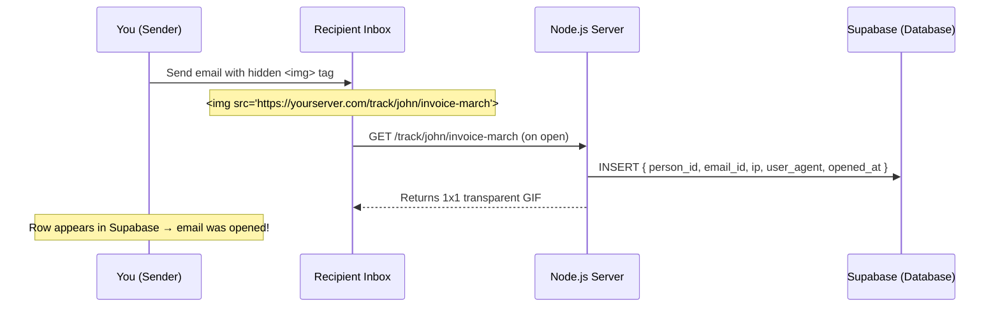

# 📧 Hidden Mail Tracker — Node.js

A lightweight email open tracker built with Node.js and Express. Embed an invisible 1×1 pixel image in any email — when the recipient opens it, their email client fetches the image and your server silently logs the event to a private database.

> ⚠️ This is the Node.js version. For the serverless Cloudflare Workers version see the `cloudflare-workers` branch.

---

## How it works



---

## Stack

| Layer | Tool | Cost |
|---|---|---|
| Server | Node.js + Express | Free |
| Database | Supabase | Free tier |
| Hosting | Glitch / Railway | Free tier |
| Repo | GitHub | Free |

---

## Project structure

```
email-tracker/
├── index.js          # Main server code (tracking logic)
├── package.json      # Dependencies
├── .env              # Local secrets — never committed
└── .gitignore        # Ensures .env is never pushed
```

---

## Code explained

### `index.js`

```javascript
require('dotenv').config(); // Load .env variables into process.env

const express = require('express');
const { createClient } = require('@supabase/supabase-js');

const app = express();

// Connect to Supabase using env variables (never hardcoded)
const supabase = createClient(process.env.SUPABASE_URL, process.env.SUPABASE_KEY);

// The 1x1 transparent GIF encoded in base64
const PIXEL = Buffer.from(
  'R0lGODlhAQABAIAAAAAAAP///yH5BAEAAAAALAAAAAABAAEAAAIBRAA7',
  'base64'
);

// Core tracking route — fires every time the email is opened
app.get('/track/:personId/:emailId', async (req, res) => {
  const { personId, emailId } = req.params;

  // Log to Supabase in background (don't await — serve pixel immediately)
  // This makes the response instant, logging happens asynchronously
  supabase.from('opens').insert({
    person_id: personId,   // who received the email e.g. "john"
    email_id: emailId,     // which email e.g. "invoice-march"
    ip: req.headers['x-forwarded-for'] || req.ip,
    user_agent: req.headers['user-agent']
  }).then(() => console.log(`Tracked: ${personId} / ${emailId}`));

  // Return the invisible pixel immediately
  res.set('Content-Type', 'image/gif');
  res.set('Cache-Control', 'no-store, no-cache, must-revalidate'); // prevent caching — critical!
  res.send(PIXEL);
});

// Health check endpoint (required by most hosting platforms)
app.get('/', (req, res) => res.send('Tracker running'));

const PORT = process.env.PORT || 3000;
app.listen(PORT, () => console.log(`Server running on port ${PORT}`));
```

### `.env`

```
SUPABASE_URL=https://xxxx.supabase.co
SUPABASE_KEY=eyJ...your anon key...
PORT=3000
```

> ⚠️ Never commit this file. It must be in `.gitignore`.

---

## Database schema (Supabase)

Run this SQL in your Supabase SQL Editor:

```sql
create table opens (
  id bigint generated always as identity primary key,
  person_id text not null,
  email_id text not null,
  opened_at timestamptz default now(),
  ip text,
  user_agent text
);

-- Enable Row Level Security
alter table opens enable row level security;

-- Allow server to write logs
create policy "allow insert" on opens
  for insert with check (true);

-- Block all reads from outside
create policy "block reads" on opens
  for select using (false);
```

---

## Setup & local development

### 1. Prerequisites

- Node.js 20+
- A [Supabase](https://supabase.com) account (free)

### 2. Clone the repo

```bash
git clone https://github.com/YOURNAME/email-tracker.git
cd email-tracker
git checkout master
npm install
```

### 3. Set up Supabase

1. Go to [supabase.com](https://supabase.com) → New project
2. Run the SQL above in the SQL Editor
3. Go to **Settings → API** and copy:
   - `Project URL`
   - `anon public key`

### 4. Create your `.env` file

```bash
cp .env.example .env
# then fill in your values
```

Or create it manually:
```
SUPABASE_URL=https://xxxx.supabase.co
SUPABASE_KEY=eyJ...
PORT=3000
```

### 5. Run locally

```bash
node index.js
# Server running on port 3000
```

Test it:
```
http://localhost:3000/track/john/test-email
```

Check your Supabase `opens` table — a new row should appear.

---

## Deployment (free hosting options)

### Option A — Glitch (easiest, no card ever)

1. Go to [glitch.com](https://glitch.com) → sign up with GitHub
2. Click **New Project** → **Import from GitHub**
3. Paste your repo URL
4. Go to **Settings** → **.env** tab
5. Add `SUPABASE_URL` and `SUPABASE_KEY`
6. Done — Glitch gives you a free URL instantly

### Option B — Railway

1. Go to [railway.app](https://railway.app) → sign up with GitHub
2. Click **New Project** → **Deploy from GitHub repo**
3. Select `email-tracker`
4. Go to **Variables** tab → add `SUPABASE_URL` and `SUPABASE_KEY`
5. Done

> ⚠️ Both free tiers sleep after ~30 min of inactivity. First request after sleep takes ~10 seconds to wake up. Fine for personal use.

---

## Usage

### Embed in an email

```html

```

**Example — tracking John's March invoice:**
```html

```

When John opens the email → a row appears in your Supabase `opens` table:

| person_id | email_id | opened_at | ip |
|---|---|---|---|
| john | invoice-march | 2024-03-26 14:32 UTC | 142.250.x.x |

### Multiple opens

Every open logs a new row — so you can see open count and timestamps:

| person_id | email_id | opened_at |
|---|---|---|
| john | invoice-march | 14:32 |
| john | invoice-march | 14:45 |
| sarah | follow-up | 15:01 |

---

## Limitations

| Issue | Detail |
|---|---|
| Gmail/Apple Mail proxy images | IP will be Google's server, not the real user. Open event still fires. |
| Pre-fetching | Some clients fetch images before user opens. Rare. |
| Forwards | Forwarded emails log under original recipient's ID |
| Image blocking | Users with images disabled won't trigger the tracker |
| Server sleeping | Free hosting tiers sleep after inactivity (see deployment notes) |

---

## Security

- ✅ Secrets stored in `.env` — never in code or repo
- ✅ `.env` listed in `.gitignore` — never pushed to GitHub
- ✅ All traffic over HTTPS
- ✅ Supabase RLS enabled — data not readable via API
- ✅ No sensitive data ever sent to the recipient

---

## Prefer serverless?

Switch to the `cloudflare-workers` branch for a version that:
- Never sleeps
- Runs on Cloudflare's global network
- Handles 100,000 requests/day free
- No server to manage

```bash
git checkout cloudflare-workers
```